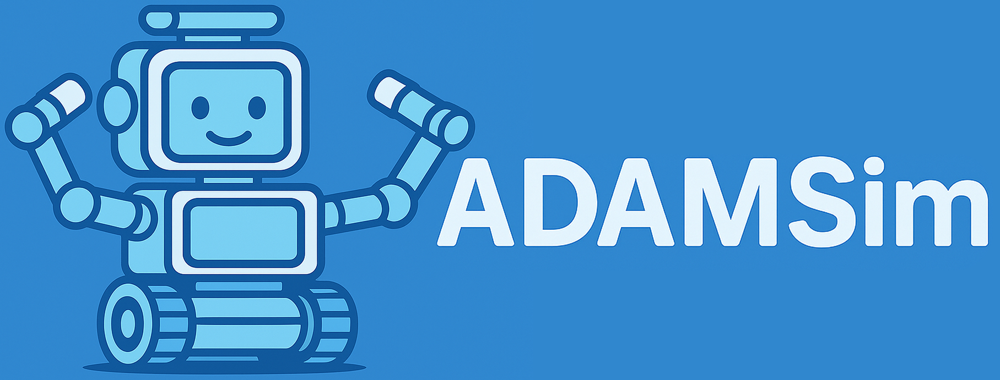

> [!IMPORTANT]
> **UPDATE:** Grippers module is now available! Check `examples/example_grippers.py` that tests the new ADAM URDF model with the Duck Grippers.

# **ADAMSim: PyBullet-Based Simulation Environment for Research on Domestic Mobile Manipulator Robots**

<p align="center">
  <a href="https://mobile-robots-group-uc3m.github.io/AdamSim/">
    
  </a>
</p>

This repository introduces ADAMSim, a PyBullet-based simulation environment tailored for Ambidextrous Domestic Autonomous Manipulator (ADAM), developed to support research in navigation, manipulation, and learning for domestic robotics. The simulator accurately replicates the structure and behavior of the physical robot, enabling robust sim-to-real and real-to-sim algorithm transfer. ADAMSim follows a modular design, including navigation, arm and hand kinematics, perception, and ROS communication. This architecture allows synchronized operation between the real robot and its digital twin. Several example applications were developed, ranging from vision and grasping tasks to navigation and teleoperation, including experiments running both simulated and real robots simultaneously. Its open-source and flexible design makes ADAMSim a powerful tool for safe and reproducible algorithm development and experimentation in household robotics. The platform is also intended to support future research in indoor mapping, advanced manipulation learning, and educational projects, serving as a test bed.

## 📋 Table of Contents
- [Website](#website)
- [Installation](#installation)
  - [Option A: Docker Setup](#option-a-docker-setup)
    - [Prerequisites](#prerequisites)
    - [Method 1: VS Code Dev Containers (Recommended)](#method-1-vs-code-dev-containers-one-click-recommended)
    - [Method 2: Terminal Method with Alias](#method-2-terminal-method-with-alias)
    - [First-Time ROS Workspace Compilation](#first-time-ros-workspace-compilation)
  - [Option B: Native Installation](#option-b-native-installation-ubuntu-2004--ros-1-noetic)
    - [1. Install Miniconda](#1-install-miniconda-highly-recommended)
    - [2. Install Repository](#2-install-repository)
    - [3. Installation of Third-Party Programs](#3-installation-of-third-party-programs)
- [Examples & Usage](#examples--usage)
- [TO DO](#to-do)
- [Citation](#citation)
  - [Acknowledgement](#acknowledgement)

---

# Website
On our website, you can access video examples as well as images that showcase some of the functionalities of this simulator.
For more information, visit our website: [ADAMSim webpage](https://mobile-robots-group-uc3m.github.io/AdamSim/)

# Installation

ADAMSim requires **ROS 1 Noetic** and **Python 3.8**. You can set up the environment either using **Docker (Recommended for Ubuntu 22.04+ or isolated setups)** or via **Native Conda Installation (Ubuntu 20.04)**.

> [!CAUTION]  
> ADAMSim has been developed for Ubuntu/Linux environments. Some PyKDL-based functions use a proprietary ROS 1 parser so they do not work natively on Windows without WSL.

## Option A: Docker Setup

Using Docker allows running ROS 1 Noetic seamlessly on modern systems (e.g., Ubuntu 22.04 / 24.04) with full NVIDIA GPU GUI acceleration.

### Prerequisites

1. **Docker**: Ensure Docker and the [NVIDIA Container Toolkit](https://docs.nvidia.com/datacenter/cloud-native/container-toolkit/latest/install-guide.html) are installed.

2. **Clone the repository**:

   ```bash
   git clone https://github.com/Mobile-Robots-Group-UC3M/AdamSim.git
   cd AdamSim
   ```

### Method 1: VS Code Dev Containers (One-Click) (Recommended)

1. Install the **Dev Containers** extension in VS Code (`ms-vscode-remote.remote-containers`).
2. Open the `AdamSim` project folder in VS Code.
3. Click on the notification in the bottom right corner **"Reopen in Container"** (or press `F1` and select `Dev Containers: Reopen in Container`).
4. VS Code will automatically start the container with full GUI/NVIDIA support and open an integrated terminal inside `/workspace`.
5. (If you update the `Dockerfile`): Press `F1` and select `Dev Containers: Rebuild and Reopen in Container` to apply your changes.

### Method 2: Terminal method with alias

#### 1. Build the Docker Image

From the repository root, build the Docker image:
  
   ```bash
   cd Adamsim
   docker build -t adamsim .
   ```

#### 2. Create the alias

To avoid typing the full command every time, add an alias to your host machine's `~/.bashrc`:

 ```bash
 alias adamsim='xhost +local:root > /dev/null && docker run -it --rm \
 --net=host \
 --ipc=host \
 --gpus=all \
 -e DISPLAY=$DISPLAY \
 -v /tmp/.X11-unix:/tmp/.X11-unix:rw \
 -e __NV_PRIME_RENDER_OFFLOAD=1 \
 -e __GLX_VENDOR_LIBRARY_NAME=nvidia \
 -e NVIDIA_VISIBLE_DEVICES=all \
 -e NVIDIA_DRIVER_CAPABILITIES=graphics,utility,compute \
 -e ROS_MASTER_URI=http://localhost:11311 \
 -e ROS_IP=127.0.0.1 \
 -e PYTHONPATH=/workspace \
 -v "$(pwd)":/workspace \
 -w /workspace \
 adamsim bash -c "rosdep update && if [ -d /workspace/catkin_ws/src ]; then rosdep install --from-paths /workspace/catkin_ws/src --ignore-src -r -y; fi; exec bash"'
 ```
Do not forget to source!:

 ```bash
 source ~/.bashrc
 ```

#### 3. Run the docker

 Once configured, you can launch the container from inside your `AdamSim` repository directory simply by running:
 
 ```bash
 cd Adamsim
 adamsim
 ```


### First-Time ROS Workspace Compilation
Upon launching the container for the first time, compile the embedded ROS 1 `catkin_ws` (which contains services for the Inspire Hands RH56DFX):

```bash
cd /workspace/catkin_ws
catkin_make
source devel/setup.bash
```

> **Note:** Edits made inside `/workspace` inside the container will automatically persist on your host machine.


## Option B: Native Installation (Ubuntu 20.04 / ROS 1 Noetic)

### 1. Install Miniconda (Highly Recommended)

It is highly recommended to install all the dependencies on a new virtual environment. For more information check the conda documentation for [installation](https://conda.io/projects/conda/en/latest/user-guide/install/index.html) and [environment management](https://conda.io/projects/conda/en/latest/user-guide/tasks/manage-environments.html). For creating the environment use the following commands on the terminal.

Create a new virtual environment with Python 3.8:

```bash
conda create -n ADAMSim python=3.8
conda activate ADAMSim
```

### 2.  Install repository
Clone the repository and install requirements:
```bash
git clone https://github.com/Mobile-Robots-Group-UC3M/AdamSim.git
cd installation
pip install -r requirements.txt
```
After that, you have to install the package in editable mode, so you can modify the code and see the changes without reinstalling it.

```bash
cd ..
pip install -e .
```
Then you are ready to work with ADAMSim 


### 3. Installation of third party programs
In order to make use of pyKDL the pip install does not work properly, therefore third party packages need to be implemented. For the correct operation it is necessary to install using the packages described in the following [web page](https://anaconda.org/conda-forge/python-orocos-kdl).

```bash
conda install conda-forge::python-orocos-kdl
sudo pip install git+https://github.com/ros/kdl_parser_py.git
```

Additionally, in case you want to use the robotic hands with the ADAM robot in the real environment, it is necessary to add the Inspire Hands package to your workspace, compile it and install the following ROS1 package:

```bash
sudo apt-get install ros-<your distro>-serial
```

# Examples & Usage

ADAMSim provides pre-built scripts in the `examples/` directory to test robot kinematics, end-effector control, and ROS integration. 

> [!NOTE]  
> If running via Docker, make sure you execute these commands inside the container terminal (either via VS Code Dev Containers or after launching the `adamsim` alias

### Running the examples

Test the ADAM URDF model configured with the Duck Grippers:
```bash
python3 examples/example_grippers.py
```

### Quickstart

To quickly start simulating the robot you simply need to instantiate the `ADAM` class with the desired configuration parameters:

```python
from scripts.adam import ADAM

# Initializa ADAM with Inspire Hands
adam = ADAM(
  end_effector = 'inspire_hands',
  use_realtime = True,
  use_fixed_base = True,
  use_ros = False,
  use_plane = True
)
```

Then you are ready to start controlling ADAM! Use the `adam` object to call the functions in each model. The function `adam.step()` maganes the simulation loop rate automatically:

```python
# INSERT YOUR PRE-SIMULATION LOOP CODE

grasp_pose = [[0.55, -0.23, 0.86], [0,0,0,1]]

adam.utils.draw_grame(grasp_pose) # Visualialize pose
adam.arm_kinematics.move_arm_to_pose_continuous(arm='right', grasp_pose)
adam.wait(3) # Wait 3 seconds

# SIMULATION LOOP
while True:

  object_grasped = adam.hand_kinematics.close_hand('right')
  if object_grasped: break

  adam.step() # Continue simulation

```


# **TO DO**
* Add documentation of the functions
* Add more examples
* Add more functionalities
* Change pyKDL with other kinematics library that works on Windows and Linux

# Citation
If you use this code, please quote our work :blush:

``` bash
@article{prados2025adamsim,
  title={ADAMSim: PyBullet-Based Simulation Environment for Research on Domestic Mobile Manipulator Robots},
  author={Prados, Adrian and Espinoza, Gonzalo and Mendez, Alberto and Mora, Alicia and Garrido, Santiago and Barber, Ramon},
  journal={Jornadas de Autom{\'a}tica},
  number={46},
  year={2025}
}
```

## Acknowledgement
This work was supported by Advanced Mobile dual-arm manipulator for Elderly People Attendance (AMME) (PID2022-139227OB-I00), funded by Ministerio de Ciencia e Innovacion.

This work has been developed in the [Mobile Robotics Group](https://github.com/Mobile-Robots-Group-UC3M) from RoboticsLab, at University Carlos III de Madrid.
